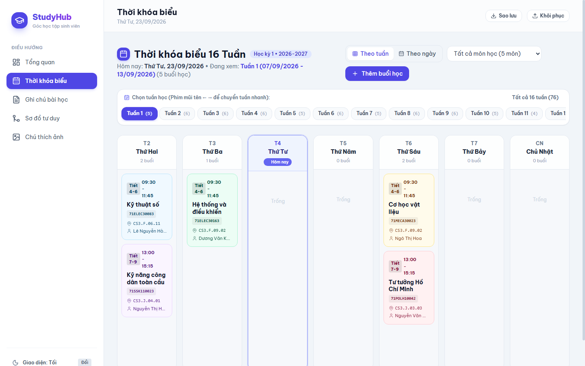

# 🎓 StudyHub - Trợ Lý Học Tập Cá Nhân Cho Sinh Viên

> Ứng dụng web học tập cá nhân toàn diện, hoạt động 100% Client-side với IndexedDB bền vững, hỗ trợ giao diện tiếng Việt và tối ưu hóa trải nghiệm trên cả Desktop lẫn Mobile.



---

## ✨ Tính Năng Nổi Bật

### 📅 1. Thời Khóa Biểu 16 Tuần (Schedule)
- **Chuẩn hóa theo cổng thông tin đào tạo:** Tích hợp đầy đủ 76 buổi học (Học kỳ 1 • Năm học 2026-2027) của 5 môn học.
- **Thanh điều hướng 16 Tuần:** Chuyển đổi nhanh giữa các tuần từ Tuần 1 đến Tuần 16 hoặc xem toàn bộ 16 tuần.
- **Nhận diện học trực tuyến:** Huy hiệu nhấp nháy cho tiết học **E-Learning** và nhãn tím cho **MS Teams**.
- **Chế độ xem linh hoạt:** Xem dạng lưới 7 ngày (Desktop), thanh chọn ngày thông minh (Mobile) và dòng thời gian (Day Timeline).
- **Phím tắt nhanh:** Dùng phím mũi tên `←` / `→` để lướt qua các tuần học.
- **Quản lý buổi học:** Thêm/sửa/xóa môn học với tính năng cảnh báo trùng lịch thông minh.

### 📝 2. Ghi Chú Bài Học (Notes)
- Trình soạn thảo Markdown trực quan với thanh công cụ nhanh (H2, H3, Bold, Code, Checklist).
- **To-do checklist tương tác:** Checkbox `- [ ]` tick chọn trực tiếp trên thẻ, tự động lưu ngay vào cơ sở dữ liệu.
- **Bộ lọc 3 tầng:** Lọc theo Môn học, Chủ đề và Thẻ `#tag`.
- Tìm kiếm toàn văn tức thì theo từ khóa.
- Tính năng ghim bài quan trọng lên đầu.

### 🧠 3. Sơ Đồ Tư Duy (Mind Map Studio)
- Canvas vô cực kéo thả, zoom/pan từ 40% đến 200%.
- Kết nối nhánh bằng đường cong **Cubic Bezier** mượt mà.
- Phím tắt thông minh: `Tab` (thêm nhánh con), `Enter` (thêm nhánh ngang hàng), `Delete` (xóa nhánh).
- Xuất ảnh PNG độ phân giải cao Retina.

### 🖼️ 4. Chú Thích Ảnh Bài Giảng (Image Annotator)
- Tải ảnh từ máy, kéo thả hoặc dán trực tiếp từ bộ nhớ tạm (`Ctrl + V`).
- Cắm mốc ghim đánh số (1, 2, 3...) trực tiếp lên vùng ảnh slide/bảng viết.
- Giao diện 2 cột đồng bộ 2 chiều (bấm vào ghim tự highlight thẻ chú thích và ngược lại).

### ⏱️ 5. Dashboard & Tiện Ích
- Widget đếm ngược thời gian thực đến tiết học tiếp theo trong ngày.
- Giao diện Sáng / Tối (Dark / Light Mode) thích ứng mượt mà.
- Sao lưu & Phục hồi cơ sở dữ liệu ra file JSON an toàn.

---

## 🛠️ Công Nghệ Sử Dụng

- **Frontend:** Pure HTML5, CSS3, ES6+ JavaScript Modules.
- **Styling:** Tailwind CSS CDN, Modern Glassmorphism Design.
- **Font & Icons:** Be Vietnam Pro / Plus Jakarta Sans, Lucide Icons.
- **Lưu trữ dữ liệu:** Trình duyệt **IndexedDB** (`StudyHubDB`), không cần backend hay database server, bảo mật và riêng tư 100%.

---

## 🚀 Hướng Dẫn Cài Đặt & Chạy Cục Bộ

1. **Clone repository về máy:**
   ```bash
   git clone https://github.com/<your-username>/<repo-name>.git
   cd <repo-name>
   ```

2. **Khởi chạy máy chủ cục bộ (Local Server):**
   - Với Python:
     ```bash
     python -m http.server 3000
     ```
   - Hoặc với Node.js:
     ```bash
     npx serve .
     ```

3. **Mở trình duyệt truy cập:**
   👉 `http://localhost:3000`

---

## 🌐 Triển Khai Miễn Phí Với GitHub Pages

Ứng dụng được thiết kế hoàn toàn tĩnh (static web app) nên có thể chạy trực tiếp trên **GitHub Pages**:
1. Vào mục **Settings** của repository trên GitHub.
2. Chọn mục **Pages** ở thanh menu bên trái.
3. Tại phần **Branch**, chọn nhánh `main` (hoặc `master`) và thư mục `/(root)`, sau đó nhấn **Save**.
4. Chờ 1-2 phút, ứng dụng sẽ có link online dạng:  
   `https://<username>.github.io/<repo-name>/`
